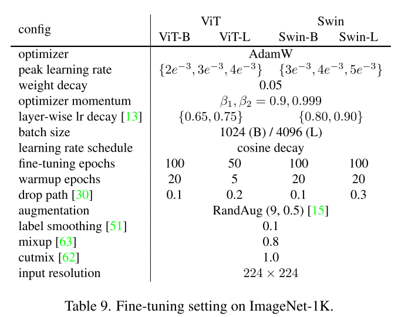

# freezeout_localmim_rho

### Important details about Freezeout

- To pretrain MIM cosine lr scheduler has been used, so lars.py is not used at all:

  
- Fine tune settings are:

  
- Freezeout uses iteration wise cosine annealing (rather than epoch-wise), line of proof:

  ```
  # A simple dummy variable that indicates we are using an iteration-wise
          # annealing scheme as opposed to epoch-wise. 
          self.lr_sched = {'itr':0}
  ```

- The code assumes 1000 iterations per epoch and assigns the following max iterations per layer:  `m.max_j =self.epochs*1000*m.lr_ratio` (WRN.py). This might be a bad assumption. If you scale the learning rate linearly with the batch size, max_j iterations can be set by epochs/batch_size rather than a constant. Freezeout might be keeping initial lr and batch size independent, which might be the reason for this 1000.
- The learning rate is set to 0.1 by default for freeezeout, the cosine annealing step uses hence 0.05 (div by 2): `m.lr = 1e-1/m.lr_ratio if self.scale_lr else 1e-1`. Also cosine annealing max iterations are adjusted uniquely for each layer:

  ```
  self.optim.param_groups[i]['lr'] = (0.05/m.lr_ratio)*(1+np.cos(np.pi*self.j/m.max_j)) if self.scale_lr else 0.05 * (1+np.cos(np.pi*self.j/m.max_j)
  ```

### Important questions

- The method would benefit from freezing the decoder (4 times usage in a forward pass), but it will be used less as we freeze stages. Freezing the decoder together with the encoder should be kept as an ablation study, as it might behave unexpectedly.
