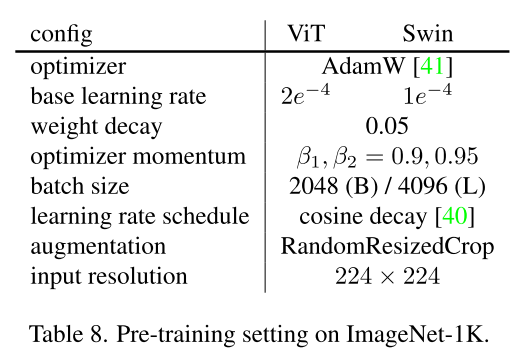
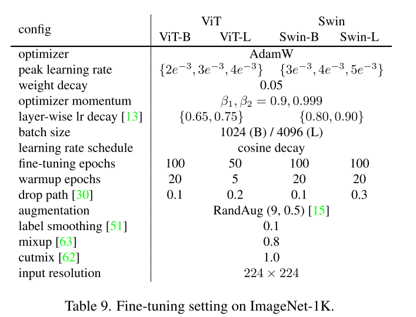

# DETAILS

## Running Experiments

### Pre-training:

Explained in the repos README.md as this, to pre-train ViT-B:
```bash
OMP_NUM_THREADS=1 python -m torch.distributed.launch --nproc_per_node=8 run_pretrain.py --batch_size 256 --model MIM_vit_base_patch16 --hog_nbins 9 --mask_ratio 0.75 --epochs 1600 --warmup_epochs 40 --blr 2e-4 --weight_decay 0.05 --data_path /path/to/imagenet/ --output_dir /output_dir/
```

#### Train Configurations:
- Effective batch size is 2048
- The learning rate is set to 2e-4 (based on repo README)
- accum_iter set to 2 for 4 gpus (normally 8).
- warm-up epoch is set to 10 for 100 epochs and 40 for all other epoch settings.
- Note that min_lr is not set in the repo's command and is not explained in the paper.
- Code uses as many gpus as there are available, hence, set CUDA_VISIBLE_DEVICES. (optional CUDA_VISIBLE_DEVICES=4,5,6,7 )

*Freezeout Pretrain for 100 epochs:*
```bash
bash record.sh CUDA_VISIBLE_DEVICES=4,5,6,7 OMP_NUM_THREADS=1 \
python3 -m torch.distributed.launch --nproc_per_node=4 --master_port=29501 run_pretrain.py \
--epochs 100 --batch_size 256 --warmup_epochs 10 \
--blr 2e-4 --world_size 4 --accum_iter 2 --model MIM_vit_base_patch16 \
--data_path /raid/utku/datasets/imagenet/classification/train/image_folders \
--output_dir pretrain/full_pretrain_out_freezeout_cubic_t0_85 --log_dir full_pretrain_out_freezeout_cubic_t0_85 \
--how_scale cubic --t_0 0.85
```

- 8 GPU:
```bash
bash record.sh CUDA_VISIBLE_DEVICES=0,1,2,3,4,5,6,7 OMP_NUM_THREADS=1 \
python3 -m torch.distributed.launch --nproc_per_node=8 --master_port=29502 run_pretrain.py \
--epochs 100 --batch_size 256 --warmup_epochs 10 \
--blr 2e-4 --world_size 8 --accum_iter 1 --model MIM_vit_base_patch16 \
--data_path /raid/utku/datasets/imagenet/classification/train/image_folders \
--output_dir pretrain/full_pretrain_out_freezeout_cubic_t0_8_fast --log_dir full_pretrain_out_freezeout_cubic_t0_8_fast \
--how_scale cubic --t_0 0.8
```

- 1 GPU:
```bash
bash record.sh CUDA_VISIBLE_DEVICES=5 OMP_NUM_THREADS=1 \
python3 -m torch.distributed.launch --nproc_per_node=1 --master_port=29505  run_pretrain.py \
--epochs 100 --batch_size 256 --warmup_epochs 10 \
--blr 2e-4 --world_size 1 --accum_iter 8 --model MIM_vit_base_patch16 \
--data_path /raid/utku/datasets/imagenet/classification/train/image_folders \
--output_dir pretrain/bench_3/full_pretrain_out_freezeout_cubic_t0_8_1gpu_save5 --log_dir bench_3/full_pretrain_out_freezeout_cubic_t0_8_1gpu_save5 \
--how_scale cubic --t_0 0.8
```

- NON LAYER WISE AND NOT SCALE LR
```bash
bash record.sh CUDA_VISIBLE_DEVICES=1 OMP_NUM_THREADS=1 \
python3 -m torch.distributed.launch --nproc_per_node=1 --master_port=29501  run_pretrain.py \
--epochs 100 --batch_size 256 --warmup_epochs 10 \
--blr 2e-4 --world_size 1 --accum_iter 8 --model MIM_vit_base_patch16 \
--data_path /raid/utku/datasets/imagenet/classification/train/image_folders \
--output_dir pretrain/non_scale_layerwise/freezeout_cubic_t0_8_1234_loss_scaler --log_dir pretrain/non_scale_layerwise/freezeout_cubic_t0_8_1234_loss_scaler \
--how_scale cubic --t_0 0.8 \
--not_scale_lr --non_layerwise_lr

bash record.sh CUDA_VISIBLE_DEVICES=5 OMP_NUM_THREADS=1 \
python3 -m torch.distributed.launch --nproc_per_node=1 --master_port=29505  run_pretrain.py \
--epochs 100 --batch_size 256 --warmup_epochs 10 \
--blr 2e-4 --world_size 1 --accum_iter 8 --model MIM_vit_base_patch16 \
--data_path /raid/utku/datasets/imagenet/classification/train/image_folders \
--output_dir pretrain/non_scale_layerwise/freezeout_cubic_t0_8_1overk_loss_scaler_all_stages --log_dir pretrain/non_scale_layerwise/freezeout_cubic_t0_8_1overk_loss_scaler_all_stages \
--how_scale cubic --t_0 0.8 \
--not_scale_lr --non_layerwise_lr --all_stages


bash record.sh CUDA_VISIBLE_DEVICES=7 OMP_NUM_THREADS=1 \
python3 -m torch.distributed.launch --nproc_per_node=1 --master_port=29507  run_pretrain.py \
--epochs 100 --batch_size 256 --warmup_epochs 10 \
--blr 2e-4 --world_size 1 --accum_iter 8 --model MIM_vit_base_patch16 \
--data_path /raid/utku/datasets/imagenet/classification/train/image_folders \
--output_dir pretrain/non_scale_layerwise/freezeout_cubic_t0_8_all_stages --log_dir pretrain/non_scale_layerwise/freezeout_cubic_t0_8_all_stages \
--how_scale cubic --t_0 0.8 \
--not_scale_lr --non_layerwise_lr --all_stages
```

- DONT FREEZE PATCH EMBED NON LAYER WISE AND NOT SCALE LR
```bash
bash record.sh CUDA_VISIBLE_DEVICES=1,2 OMP_NUM_THREADS=1 \
python3 -m torch.distributed.launch --nproc_per_node=2 --master_port=29502  run_pretrain.py \
--epochs 100 --batch_size 512 --warmup_epochs 10 \
--blr 2e-4 --world_size 2 --accum_iter 2 --model MIM_vit_base_patch16 \
--data_path /raid/utku/datasets/imagenet/classification/train/image_folders \
--output_dir pretrain/non_scale_layerwise/freezeout_cubic_t0_8_dont_freeze_pe --log_dir pretrain/non_scale_layerwise/freezeout_cubic_t0_8_dont_freeze_pe \
--how_scale cubic --t_0 0.8 \
--not_scale_lr --non_layerwise_lr --dont_freeze_pe

bash record.sh CUDA_VISIBLE_DEVICES=5 OMP_NUM_THREADS=1 \
python3 -m torch.distributed.launch --nproc_per_node=1 --master_port=29505  run_pretrain.py \
--epochs 100 --batch_size 256 --warmup_epochs 10 \
--blr 2e-4 --world_size 1 --accum_iter 8 --model MIM_vit_base_patch16 \
--data_path /raid/utku/datasets/imagenet/classification/train/image_folders \
--output_dir pretrain/non_scale_layerwise/freezeout_cubic_t0_8_1overk_loss_scaler_all_stages --log_dir pretrain/non_scale_layerwise/freezeout_cubic_t0_8_1overk_loss_scaler_all_stages \
--how_scale cubic --t_0 0.8 \
--not_scale_lr --non_layerwise_lr --all_stages


bash record.sh CUDA_VISIBLE_DEVICES=7 OMP_NUM_THREADS=1 \
python3 -m torch.distributed.launch --nproc_per_node=1 --master_port=29507  run_pretrain.py \
--epochs 100 --batch_size 256 --warmup_epochs 10 \
--blr 2e-4 --world_size 1 --accum_iter 8 --model MIM_vit_base_patch16 \
--data_path /raid/utku/datasets/imagenet/classification/train/image_folders \
--output_dir pretrain/non_scale_layerwise/freezeout_cubic_t0_8_all_stages --log_dir pretrain/non_scale_layerwise/freezeout_cubic_t0_8_all_stages \
--how_scale cubic --t_0 0.8 \
--not_scale_lr --non_layerwise_lr --all_stages
```

- DEBUG TRAIN
```bash
bash record.sh CUDA_VISIBLE_DEVICES=0,1,2,3,4,5,6,7 OMP_NUM_THREADS=1 \
python3 -m torch.distributed.launch --nproc_per_node=8 --master_port=29501 run_pretrain.py \
--epochs 9 --batch_size 32 --warmup_epochs 1 \
--blr 2e-4 --world_size 8 --accum_iter 1 --model MIM_vit_base_patch16 \
--data_path /raid/utku/datasets/imagenet/classification/train/demo_dataset \
--output_dir pretrain/debug --log_dir debug --debug \
--how_scale cubic --t_0 0.8
```


*Regular Pretrain for 100 epochs:*

```bash
bash record.sh  CUDA_VISIBLE_DEVICES=4,5,6,7 OMP_NUM_THREADS=1 \
python3 -m torch.distributed.launch --nproc_per_node=4 --master_port=29502 run_pretrain.py \
--epochs 100 --batch_size 256 --warmup_epochs 10 \
--blr 2e-4 --world_size 4 --accum_iter 2 --weight_decay 0.05 \
--model MIM_vit_base_patch16 --hog_nbins 9 --mask_ratio 0.75 \
--data_path /raid/utku/datasets/imagenet/classification/train/image_folders \
--output_dir pretrain/full_pretrain_out --log_dir full_pretrain_out
```

- 8 GPU:
```bash
bash record.sh CUDA_VISIBLE_DEVICES=0,1,2,3,4,5,6,7 OMP_NUM_THREADS=1 \
python3 -m torch.distributed.launch --nproc_per_node=8 --master_port=29502 run_pretrain.py \
--epochs 100 --batch_size 256 --warmup_epochs 10 \
--blr 2e-4 --world_size 8 --accum_iter 1 --weight_decay 0.05 \
--model MIM_vit_base_patch16 --hog_nbins 9 --mask_ratio 0.75 \
--data_path /raid/utku/datasets/imagenet/classification/train/image_folders \
--output_dir pretrain/full_pretrain_out_fast --log_dir full_pretrain_out_fast
```

- 1 GPU
```bash
bash record.sh CUDA_VISIBLE_DEVICES=7 OMP_NUM_THREADS=1 \
python3 -m torch.distributed.launch --nproc_per_node=1 --master_port=29501 run_pretrain.py \
--epochs 100 --batch_size 256 --warmup_epochs 10 \
--blr 2e-4 --world_size 1 --accum_iter 8 --weight_decay 0.05 \
--model MIM_vit_base_patch16 --hog_nbins 9 --mask_ratio 0.75 \
--data_path /raid/utku/datasets/imagenet/classification/train/image_folders \
--output_dir pretrain/full_pretrain_out_1gpu --log_dir full_pretrain_out_1gpu
```

### Fine Tuning:

Explained in the repos README.md as this, to finetune ViT-B:
```bash
OMP_NUM_THREADS=1 python -m torch.distributed.launch --nproc_per_node=8 run_finetune.py --batch_size 128 --model vit_base_patch16 --finetune /path/to/checkpoint.pth --epochs 100 --warmup_epochs 20 --lr 2e-3 --min_lr 1e-5 --layer_decay 0.65 --weight_decay 0.05 --drop_path 0.1 --reprob 0.25 --mixup 0.8 --cutmix 1.0 --dist_eval --data_path /path/to/imagenet/ --output_dir /output_dir/
```

#### Training configurations
- Effective batch size is 1024.
- For 100-epoch pre-trained model, we set lr=4e-3, layer_decay=0.75 and min_lr=1e-6 

*Finetune Freezeout-100 epochs pre-trained model:*
```bash
bash record.sh CUDA_VISIBLE_DEVICES=4,5,6,7 OMP_NUM_THREADS=1 \
python3 -m torch.distributed.launch --nproc_per_node=4 --master_port=29503 run_finetune.py \
--world_size 4 --accum_iter 2 \
--batch_size 128 --model vit_base_patch16 --finetune /raid/home_yedek/utku/ViTFreeze/ViT/full_pretrain_out_freezeout_cubic_t0_8_fast/checkpoint-99.pth \
--epochs 100 --warmup_epochs 20 --lr 4e-3 --min_lr 1e-6 --layer_decay 0.75 \
--weight_decay 0.05 --drop_path 0.1 --reprob 0.25 --mixup 0.8 --cutmix 1.0 --dist_eval \
--data_path /raid/utku/datasets/imagenet/classification/ \
--output_dir finetune/full_finetune_out_freezeout_cubic_t0_8_fast/ --log_dir finetune/full_finetune_out_freezeout_cubic_t0_8_fast
```

- 8 GPU:
```bash
bash record.sh CUDA_VISIBLE_DEVICES=0,1,2,3,4,5,6,7 OMP_NUM_THREADS=1 \
python3 -m torch.distributed.launch --nproc_per_node=8 --master_port=29500 run_finetune.py \
--world_size 8 --accum_iter 1 \
--batch_size 128 --model vit_base_patch16 --finetune /raid/home_yedek/utku/ViTFreeze/ViT/full_pretrain_out_freezeout_cubic_t0_8_fast/checkpoint-99.pth \
--epochs 100 --warmup_epochs 20 --lr 4e-3 --min_lr 1e-6 --layer_decay 0.75 \
--weight_decay 0.05 --drop_path 0.1 --reprob 0.25 --mixup 0.8 --cutmix 1.0 --dist_eval \
--data_path /raid/utku/datasets/imagenet/classification/ \
--output_dir finetune/full_finetune_out_freezeout_cubic_t0_8_fast/ --log_dir finetune/full_finetune_out_freezeout_cubic_t0_8_fast
```

-- 2 GPU:
```bash
bash record.sh CUDA_VISIBLE_DEVICES=0,1 OMP_NUM_THREADS=1 \
python3 -m torch.distributed.launch --nproc_per_node=2 --master_port=29500 run_finetune.py \
--world_size 2 --accum_iter 4 \
--batch_size 128 --model vit_base_patch16 --finetune /raid/home_yedek/utku/ViTFreeze/ViT/full_pretrain_out_freezeout_cubic_t0_8_fast/checkpoint-99.pth \
--epochs 100 --warmup_epochs 20 --lr 4e-3 --min_lr 1e-6 --layer_decay 0.75 \
--weight_decay 0.05 --drop_path 0.1 --reprob 0.25 --mixup 0.8 --cutmix 1.0 --dist_eval \
--data_path /raid/utku/datasets/imagenet/classification/ \
--output_dir finetune/full_finetune_out_freezeout_cubic_t0_8_fast/ --log_dir finetune/full_finetune_out_freezeout_cubic_t0_8_fast
```

-- 1 GPU:
```bash
bash record.sh CUDA_VISIBLE_DEVICES=2 OMP_NUM_THREADS=1 \
python3 -m torch.distributed.launch --nproc_per_node=1 --master_port=29502 run_finetune.py \
--world_size 1 --accum_iter 8 \
--batch_size 128 --model vit_base_patch16 --finetune /raid/home_yedek/utku/ViTFreeze/ViT_orig/full_pretrain_out_slow/checkpoint-90.pth \
--epochs 100 --warmup_epochs 20 --lr 4e-3 --min_lr 1e-6 --layer_decay 0.75 \
--weight_decay 0.05 --drop_path 0.1 --reprob 0.25 --mixup 0.8 --cutmix 1.0 --dist_eval \
--data_path /raid/utku/datasets/imagenet/classification/ \
--output_dir finetune/full_pretrain_out_slow/checkpoint-90 --log_dir finetune/full_pretrain_out_slow/checkpoint-90


bash record.sh CUDA_VISIBLE_DEVICES=3 OMP_NUM_THREADS=1 \
python3 -m torch.distributed.launch --nproc_per_node=1 --master_port=29503 run_finetune.py \
--world_size 1 --accum_iter 8 \
--batch_size 128 --model vit_base_patch16 --finetune /raid/home_yedek/utku/ViTFreeze/ViT_orig/full_pretrain_out_slow/checkpoint-80.pth \
--epochs 100 --warmup_epochs 20 --lr 4e-3 --min_lr 1e-6 --layer_decay 0.75 \
--weight_decay 0.05 --drop_path 0.1 --reprob 0.25 --mixup 0.8 --cutmix 1.0 --dist_eval \
--data_path /raid/utku/datasets/imagenet/classification/ \
--output_dir finetune/full_pretrain_out_slow/checkpoint-80 --log_dir finetune/full_pretrain_out_slow/checkpoint-80

bash record.sh CUDA_VISIBLE_DEVICES=4 OMP_NUM_THREADS=1 \
python3 -m torch.distributed.launch --nproc_per_node=1 --master_port=29504 run_finetune.py \
--world_size 1 --accum_iter 8 \
--batch_size 128 --model vit_base_patch16 --finetune /raid/home_yedek/utku/ViTFreeze/ViT_orig/full_pretrain_out_slow/checkpoint-70.pth \
--epochs 100 --warmup_epochs 20 --lr 4e-3 --min_lr 1e-6 --layer_decay 0.75 \
--weight_decay 0.05 --drop_path 0.1 --reprob 0.25 --mixup 0.8 --cutmix 1.0 --dist_eval \
--data_path /raid/utku/datasets/imagenet/classification/ \
--output_dir finetune/full_pretrain_out_slow/checkpoint-70 --log_dir finetune/full_pretrain_out_slow/checkpoint-70

bash record.sh CUDA_VISIBLE_DEVICES=5 OMP_NUM_THREADS=1 \
python3 -m torch.distributed.launch --nproc_per_node=1 --master_port=29505 run_finetune.py \
--world_size 1 --accum_iter 8 \
--batch_size 128 --model vit_base_patch16 --finetune /raid/home_yedek/utku/ViTFreeze/ViT_orig/full_pretrain_out_slow/checkpoint-60.pth \
--epochs 100 --warmup_epochs 20 --lr 4e-3 --min_lr 1e-6 --layer_decay 0.75 \
--weight_decay 0.05 --drop_path 0.1 --reprob 0.25 --mixup 0.8 --cutmix 1.0 --dist_eval \
--data_path /raid/utku/datasets/imagenet/classification/ \
--output_dir finetune/full_pretrain_out_slow/checkpoint-60 --log_dir finetune/full_pretrain_out_slow/checkpoint-60

bash record.sh CUDA_VISIBLE_DEVICES=6 OMP_NUM_THREADS=1 \
python3 -m torch.distributed.launch --nproc_per_node=1 --master_port=29506 run_finetune.py \
--world_size 1 --accum_iter 8 \
--batch_size 128 --model vit_base_patch16 --finetune /raid/home_yedek/utku/ViTFreeze/ViT_orig/full_pretrain_out_slow/checkpoint-50.pth \
--epochs 100 --warmup_epochs 20 --lr 4e-3 --min_lr 1e-6 --layer_decay 0.75 \
--weight_decay 0.05 --drop_path 0.1 --reprob 0.25 --mixup 0.8 --cutmix 1.0 --dist_eval \
--data_path /raid/utku/datasets/imagenet/classification/ \
--output_dir finetune/full_pretrain_out_slow/checkpoint-50 --log_dir finetune/full_pretrain_out_slow/checkpoint-50

bash record.sh CUDA_VISIBLE_DEVICES=5 OMP_NUM_THREADS=1 \
python3 -m torch.distributed.launch --nproc_per_node=1 --master_port=29505 run_finetune.py \
--world_size 1 --accum_iter 8 \
--batch_size 128 --model vit_base_patch16 --finetune /raid/utku/ViTFreeze/ViT/pretrain/non_scale_layerwise_failed/freezeout_cubic_t0_8/checkpoint-59.pth \
--epochs 100 --warmup_epochs 20 --lr 4e-3 --min_lr 1e-6 --layer_decay 0.75 \
--weight_decay 0.05 --drop_path 0.1 --reprob 0.25 --mixup 0.8 --cutmix 1.0 --dist_eval \
--data_path /raid/utku/datasets/imagenet/classification/ \
--output_dir finetune/non_scale_layerwise/freezeout_cubic_t0_8_checkpoint-59 --log_dir finetune/non_scale_layerwise/freezeout_cubic_t0_8_checkpoint-59

```


-- Resume 1 GPU:
```bash
bash record.sh CUDA_VISIBLE_DEVICES=7 OMP_NUM_THREADS=1 \
python3 -m torch.distributed.launch --nproc_per_node=1 --master_port=29507 run_finetune.py 
--resume /raid/home_yedek/utku/ViTFreeze/ViT/finetune/bench_1/full_finetune_out_freezeout_cubic_t0_85/checkpoint-40.pth \
--world_size 1 --accum_iter 8 \
--batch_size 128 --model vit_base_patch16 \
--epochs 100 --warmup_epochs 20 --lr 4e-3 --min_lr 1e-6 --layer_decay 0.75 \
--weight_decay 0.05 --drop_path 0.1 --reprob 0.25 --mixup 0.8 --cutmix 1.0 --dist_eval \
--data_path /raid/utku/datasets/imagenet/classification/ \
--output_dir finetune/bench_1/full_finetune_out_freezeout_cubic_t0_85 --log_dir finetune/bench_1/full_finetune_out_freezeout_cubic_t0_85
```

*Finetune Regular-100 epochs pre-trained model:*
```bash
bash record.sh CUDA_VISIBLE_DEVICES=4,5,6,7 OMP_NUM_THREADS=1 \
python3 -m torch.distributed.launch --nproc_per_node=4 --master_port=29504 run_finetune.py \
--world_size 4 --accum_iter 2 \
--batch_size 128 --model vit_base_patch16 --finetune /raid/home_yedek/utku/ViTFreeze/ViT/full_pretrain_out/checkpoint-99.pth \
--epochs 100 --warmup_epochs 20 --lr 4e-3 --min_lr 1e-6 --layer_decay 0.75 \
--weight_decay 0.05 --drop_path 0.1 --reprob 0.25 --mixup 0.8 --cutmix 1.0 --dist_eval \
--data_path /raid/utku/datasets/imagenet/classification/ \
--output_dir full_finetune_out/ --log_dir full_finetune_out
```

- 8 GPU:
```bash
bash record.sh CUDA_VISIBLE_DEVICES=0,1,2,3,4,5,6,7 OMP_NUM_THREADS=1 \
python3 -m torch.distributed.launch --nproc_per_node=8 --master_port=29504 run_finetune.py \
--world_size 8 --accum_iter 1 \
--batch_size 128 --model vit_base_patch16 --finetune /raid/home_yedek/utku/ViTFreeze/ViT/full_pretrain_out/checkpoint-99.pth \
--epochs 100 --warmup_epochs 20 --lr 4e-3 --min_lr 1e-6 --layer_decay 0.75 \
--weight_decay 0.05 --drop_path 0.1 --reprob 0.25 --mixup 0.8 --cutmix 1.0 --dist_eval \
--data_path /raid/utku/datasets/imagenet/classification/ \
--output_dir full_finetune_out/ --log_dir full_finetune_out
```


### Linear Probing:
- 2048 batch size * 8 gpu (or accum_iter)
- blr is 0.1 --->  lr = 0.1*2048/256 * 8 = 6.4
- weight_decay is 0.0
- epochs 90
- model vit_base_patch16
- cls_token 
- world_size 1
- accum_iter 8


```bash
bash record.sh CUDA_VISIBLE_DEVICES=6 OMP_NUM_THREADS=1 \
python3 -m torch.distributed.launch --nproc_per_node=1 --master_port=29506 run_linprobe.py \
--world_size 1 --accum_iter 8 \
--batch_size 2048 --model vit_base_patch16 --finetune /raid/home_yedek/utku/ViTFreeze/ViT/pretrain/bench_1/full_pretrain_out_freezeout_cubic_t0_8_fast/checkpoint-99.pth \
--epochs 90 --warmup_epochs 10 --blr 0.1 \
--weight_decay 0.0 --dist_eval \
--data_path /raid/utku/datasets/imagenet/classification/ \
--output_dir linprob_out/bench_1 --log_dir linprob_out/bench_1
```
```bash
bash record.sh CUDA_VISIBLE_DEVICES=7 OMP_NUM_THREADS=1 \
python3 -m torch.distributed.launch --nproc_per_node=1 --master_port=29507 run_linprobe.py \
--world_size 1 --accum_iter 8 \
--batch_size 2048 --model vit_base_patch16 --finetune /raid/home_yedek/utku/ViTFreeze/ViT/pretrain/bench_2/full_pretrain_out_freezeout_cubic_t0_65_1gpu/checkpoint-99.pth \
--epochs 90 --warmup_epochs 10 --blr 0.1 \
--weight_decay 0.0 --dist_eval \
--data_path /raid/utku/datasets/imagenet/classification/ \
--output_dir linprob_out/bench_2 --log_dir linprob_out/bench_2
```

### k-NN Clasification:
- results should be independent of batch-size 
- model vit_base_patch16
- orig image is 256, and it is cropped to 224
- cls_token 
- world_size 1
- accum_iter 8


```bash
bash record.sh CUDA_VISIBLE_DEVICES=6 OMP_NUM_THREADS=1 \
python3 -m torch.distributed.launch --nproc_per_node=1 --master_port=29509 run_knn.py \
--world_size 1 \
--batch_size 128 --model vit_base_patch16 --finetune /raid/home_yedek/utku/ViTFreeze/ViT/pretrain/bench_3/full_pretrain_out_freezeout_cubic_t0_8_1gpu_not_scale_lr/checkpoint-99.pth \
--dist_eval \
--data_path /raid/utku/datasets/imagenet/classification/ \
--output_dir knn_out/bench_3/full_pretrain_out_freezeout_cubic_t0_8_1gpu_not_scale_lr_checkpoint-99 --log_dir knn_out/bench_3/full_pretrain_out_freezeout_cubic_t0_8_1gpu_not_scale_lr_checkpoint-99

bash record.sh CUDA_VISIBLE_DEVICES=6 OMP_NUM_THREADS=1 \
python3 -m torch.distributed.launch --nproc_per_node=1 --master_port=29506 run_knn.py \
--world_size 1 \
--batch_size 128 --model vit_base_patch16 --finetune /raid/home_yedek/utku/ViTFreeze/ViT/pretrain/bench_3/full_pretrain_out_freezeout_cubic_t0_8_1gpu_save5/checkpoint-99.pth \
--dist_eval \
--data_path /raid/utku/datasets/imagenet/classification/ \
--output_dir knn_out/bench_3/full_pretrain_out_freezeout_cubic_t0_8_1gpu_save5_checkpoint-99 --log_dir knn_out/bench_3/full_pretrain_out_freezeout_cubic_t0_8_1gpu_save5_checkpoint-99

bash record.sh CUDA_VISIBLE_DEVICES=6 OMP_NUM_THREADS=1 \
python3 -m torch.distributed.launch --nproc_per_node=1 --master_port=29509 run_knn.py \
--world_size 1 \
--batch_size 128 --model vit_base_patch16 --finetune /raid/home_yedek/utku/ViTFreeze/ViT_orig/full_pretrain_out_1gpu/checkpoint-99.pth \
--dist_eval \
--data_path /raid/utku/datasets/imagenet/classification/ \
--output_dir knn_out/fullpretrain/full_pretrain_out_1gpu_checkpoint-99 --log_dir knn_out/fullpretrain/full_pretrain_out_1gpu_checkpoint-99
```


## Steps to add Freezeout

- Simple guide: [https://chat.openai.com/share/30777d71-4944-41ad-80a3-17dfca5bac7a](https://chat.openai.com/share/30777d71-4944-41ad-80a3-17dfca5bac7a)

### Step 1: Add FreezeOut Specific Variables

Add FreezeOut specific variables like `active`, `layer_index`, `max_j`, and `lr_ratio` to the layers you want to freeze. This is similar to what you did in the Wide ResNet model.

### Step 2: Modify the Optimizer

Modify the optimizer to take into account the `lr_ratio` for each layer, similar to how it's done in the Wide ResNet model.

### Step 3: Update Learning Rate

Implement a function to update the learning rate and freeze layers based on the `max_j` and `j` (iteration count), similar to the `update_lr` function in the Wide ResNet model. Both freezeout and localmim uses iteration count as steps for cosine annealing.

### Step 4: Modify the Forward Pass

Modify the forward pass to check if a layer is active or not. If it's not active, detach its gradients.

Here's a simplified example focusing on the key parts:

```
import numpy as np

scale_fn = {'linear':lambda x: x, 'squared': lambda x: x**2, 'cubic': lambda x: x**3}

# ... (existing code)

class BlockWithFreezeOut(Block):  # Assuming Block is your existing Block class
    def __init__(self, *args, layer_index, **kwargs):
        super(BlockWithFreezeOut, self).__init__(*args, **kwargs)
        self.active = True
        self.layer_index = layer_index
        self.lr_ratio = scale_fn['cubic'](0.1 + (1 - 0.1) * float(self.layer_index) / 100)  # Replace 100 with total layers
        self.max_j = 100 * 1000 * self.lr_ratio  # Replace 100 with total epochs

# ... (existing code)

class MaskedAutoencoderViT(nn.Module):
    def __init__(self, *args, **kwargs):
        super(MaskedAutoencoderViT, self).__init__(*args, **kwargs)
  
        # Replace existing blocks with BlockWithFreezeOut
        self.blocks = nn.ModuleList([
            BlockWithFreezeOut(*block_args, layer_index=i) for i, block_args in enumerate(self.blocks)
        ])
  
        # Initialize optimizer with lr_ratio
        self.optim = optim.SGD([{'params': m.parameters(), 'lr': m.lr_ratio} for m in self.modules() if hasattr(m, 'active')],  
                         nesterov=True, momentum=0.9, weight_decay=1e-4)
  
        self.j = 0  # Iteration counter

    def update_lr(self):
        # Similar to update_lr in Wide ResNet
        # ...

    def forward(self, x):
        # Modify to include active check
        for block in self.blocks:
            if block.active:
                x = block(x)
            else:
                x = block(x).detach()
        # ... (rest of the forward logic)
```

This is a simplified example and you'll need to adapt it to fit into your existing MIM ViT codebase. The key is to add the FreezeOut logic to the layers you want to freeze and then manage their state during training.

## Important details about Freezeout

- To pretrain MIM cosine lr scheduler has been used, so lars.py is not used at all:

  
- Fine tune settings are:

  
- Freezeout uses iteration wise cosine annealing (rather than epoch-wise), line of proof:

  ```
  # A simple dummy variable that indicates we are using an iteration-wise
          # annealing scheme as opposed to epoch-wise. 
          self.lr_sched = {'itr':0}
  ```

- The code assumes 1000 iterations per epoch and assigns the following max iterations per layer:  `m.max_j =self.epochs*1000*m.lr_ratio` (WRN.py). This might be a bad assumption. If you scale the learning rate linearly with the batch size, max_j iterations can be set by epochs/batch_size rather than a constant. Freezeout might be keeping initial lr and batch size independent, which might be the reason for this 1000.
- The learning rate is set to 0.1 by default for freeezeout, the cosine annealing step uses hence 0.05 (div by 2): `m.lr = 1e-1/m.lr_ratio if self.scale_lr else 1e-1`. Also cosine annealing max iterations are adjusted uniquely for each layer:

  ```
  self.optim.param_groups[i]['lr'] = (0.05/m.lr_ratio)*(1+np.cos(np.pi*self.j/m.max_j)) if self.scale_lr else 0.05 * (1+np.cos(np.pi*self.j/m.max_j)
  ```

## Important details about LocalMIM
- NOTE: Weight decay is applied selectively to non-bias or normalization layers with: `optim_factory.param_groups_weight_decay(model_without_ddp, args.weight_decay)`.
- NOTE: A different decay is applied during fine tuning: `param_groups_lrd`
- NOTE: Gradient clipping is only applied during fine tuning, not pretraining. Only amp scaling is applied during pretraining.
- NOTE: For pretraining, accum_iter: Accumulate gradient iterations (for increasing the effective batch size under memory constraints)
- NOTE: Gradient Updates: Make sure that setting custom parameter groups doesn't interfere with how gradients are updated. You've mentioned that gradients will be accumulated; ensure that's compatible with your custom parameter groups.
- NOTE: min_lr is 0 based on freeze_out(j/max_j becomes 1 and layer is frozen after that)
- NOTE: blr is set already, you have to set batch_size to the same number as localmim paper.
- NOTE: the cls token serves as global image context summarizer, but here (MIM) it does not have a clear purpose (can be frozen)
- NOTE as the transformer has skip connection, the first input will flow till the end untouched.
- NOTE localmim and freezeout both use epoch count for cosine annealing.


## Imp and Env details
*Note*: Due to LocalMIM not sharing their environemnt specifications, we had to adjust timm python package to match the model architecture and logic correctly.
* Changed for finetunning (/opt/conda/lib/python3.10/site-packages/timm/data/transforms.py) indexing type mismatch:
```python
def str_to_pil_interp(mode_str):
    if isinstance(mode_str,str):
        return _str_to_pil_interpolation[mode_str]
    else:
        return _str_to_pil_interpolation[mode_str.value]


def str_to_interp_mode(mode_str):
    if has_interpolation_mode:
        if isinstance(mode_str,str):
            return _str_to_torch_interpolation[mode_str]
        else:
            return _str_to_torch_interpolation[mode_str.value]
    else:
        if isinstance(mode_str,str):
            return _str_to_pil_interpolation[mode_str]
        else:
            return _str_to_pil_interpolation[mode_str.value]
```

* Commented out the lines below in the `vision_transformer.py` code of timm models (/opt/conda/lib/python3.10/site-packages/timm/models/vision_transformer.py), this ensures Identity functions being removed and avg global pooling is always selected (since the code overwrites the `forward_features` mehtod in `models_vit.py` (`VisionTransformer` class)):

```python
def forward_head(self, x, pre_logits: bool = False):
        # if self.global_pool:
        #     x = x[:, self.num_prefix_tokens:].mean(dim=1) if self.global_pool == 'avg' else x[:, 0]
        # x = self.fc_norm(x)
        x = self.head_drop(x)
        return x if pre_logits else self.head(x)
```


# Steps for feature masking
*Steps*:
- first understand what the encoder,decoder,hog encoder and does by dry running (hand tracing)
For each stage freezeout feature encoder output update:
- Eliminate the img forward pass.
- Store img feature outputs (128,196,728) just like images.
- Mask them by keeping the order and mask information (%75)
- Pass this from the encoder.
- Pass the output features to the decoder.

- *BIG TODO*: Make the decoder output match the input to the encoder (128,196,728) (not the whole image):
    - Are the hog_enc layers necessary here? The paper refers to the method without HOG, where is the imp (can be helpful).
    - The decoder output shape is different for each layer originally, how to handle this?
    - Should I prune the decoder outputs simultaneously as I prune the encoder inputs for symmetry (ideally I should)?


# IMPORTANT REFERENCES
- Large initial learning rates generalize better, as small learning rates tend to memorize hard to fit easy to generalize patterns easier: Towards Explaining the Regularization Effect of Initial Large Learning Rate in Training Neural Networks. 
- Large learning rates generalize better: On the Benefits of Large Learning Rates for Kernel Methods. 


# Important questions
- Does the multi-scale learning support freezeout? Does it allow earlier freezing?
- The model achieves peak results much earlier than the target epoch count. Is this due to freezeout learning rate scheduling? Or is it part of the nature of localmim?

# IMPORTANT OBSERVATIONS
- Multi-scale learning might enable early freezing of layers without accuracy drop (like freezeout). Having more tasks for the initial layers might be a better way for AdamW, while lr increasing in for SGD was useful, it is not effective for AdamW, as it is not sensitive to learning rate. Multi-scale training, by default might benefit early layer convergence and freezing a lot, and early layers might be more important for transfer learning in MIM. -> If my intuition is right, multi-scale training might allow much earlier layer freezing.
- The freezout learning rate schedule harms the model performance and does not help with convergence speed.
- localmim intrinsically converges much faster, the 100 vs 1600 epoch is not very different compared to MAE.
- Stagewise task losses magnitudes are 4,3,2,1 -> This means there is a default lr scheduling like freezeout. To apply freezeout, you should reduce the learning rates per stage first, then scale the learning rates to match freezeout. -> Rather than scaling with 4,3,2,1 -> scaling with 1/4, 1/3, 1/2, 1 might help the convergence and avoid extreme gradient updates for initial layers.
- The model achieves peak results much earlier than the target epoch count -> lowering the learning rate prematurely might harm especially less epoch trainings (100 epoch). Hence, cosine anealing might be very bad for low epoch pre-training, or maybe even long trainings. Exhausting the dataset in self-supervised learning might be much more difficult than regular supevised training. Train a model with constant learning rate or something similar. If this is caused by freezing the model that is also nice (artificial speed up), which might show that training early layers is much more valuable.
- The model perfors better when there is not lr scaling or freezing operation but by directly stopping training at early epochs like 80-70, learning rate scheduling turned out to be useless with Adam probably.

# IDEAS and TODOs
*Important*
TODO lr schedule per layer olmadan:
- I think, giving the same weights to the tasks are not fair, final stage is more important. Reduce the weights of early stages (even curriculum is possible). Also, doubling lr is not the same as doubling the task weight, as doubling the task weight for AdamW should correspond to doubling the lr in SGD.
- Train the model without lr scaling or layerwise lr for different t0 values (0.8, 0.7, 0.9, 0.6) and train different model checkpoints (70-65-60-55-50-45-40), adjust the learning rate (keep it high) and pre-train again if the original model also stops improving. But the max achieved leraning rate for 100 and 1600 are not much different (it is 83.3 to 84)
- Add more stage tasks (multi-scale) for greater early layer convergence speed.
- Add stage wise different tasks for more varying supervision and layer-fit tasks.


TODO curious thoughts:
- Great Idea: Self distillation might improve the use of initial layers for the SSL task and improve convergence speed. Transitive distillation might work well (similar to multi-scale training.).
- nlp layer dropping method.
- sabit learning rate ile dene (cosine hasar veriyor olabilir mi lr fazla erken düşürürerek?), Learning rate sabit kalsa daha iyi sonuç alınır mı. 

TODO Fine-tuning hızlandırmak:
- pre-training yerine finetuning de freeze etmek hızlandırmak için daha iyi olabilir gibi duruyor, intuitive olarak freezing transfer learning de kullanılıyor (ama lower epoch sonuçları bariz daha kötü finetune edilen modeling, freezing iyi çalışmayabilir).
- fine-tuning'in de multi-scale olması mantıklı duruyor.


*mid*
- Use every layer for multi-scale reconsturction. The paper claims that this helps early layers to converge faster (just like skip connections) and multi-scale local tasks are working better than global single scale reconstruction. This will help premature freezing performance also. 
- Increasing masking ratio to increase computation speed etc.
- Try add a curriculum to the model by : 1. Adjusting the stage losses, weights, lrs accordingly 2. With token distance based difficulty.

*maybe*
- TODO 100 epoch pre-trained model linear probing might benefit from larger learning rate like as in localmim fine-tuning code.
